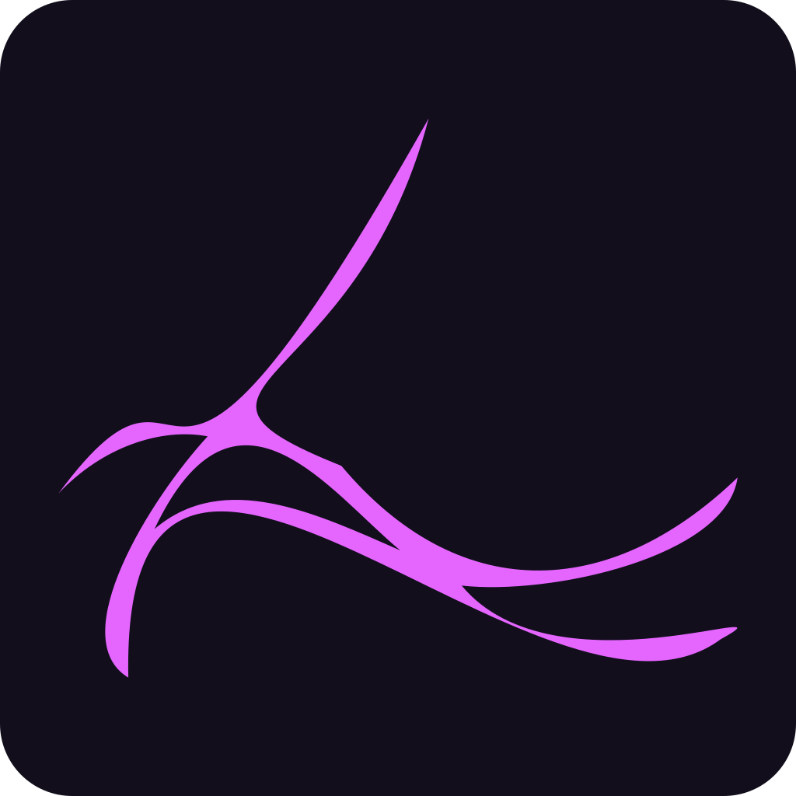

  
   
  

# Eludris

Eludris is simply put a group of people —not necessarily programmers— who come
together to make fun and awesome stuff.

Since right now everything is so-so and nothing is set in stone expect a more
"high effort" README sometimes soon.

## Projects

- Eludris: A FOSS decentralized federated social media platform with e2ee, heavily
inspired by Discord, Reddit and Twitter. (WIP, private for now).
- Cognite: A better way to make large scale discord bot's that relies on microservices,
powered by Apache Kafka, KeyDB and Rust.

